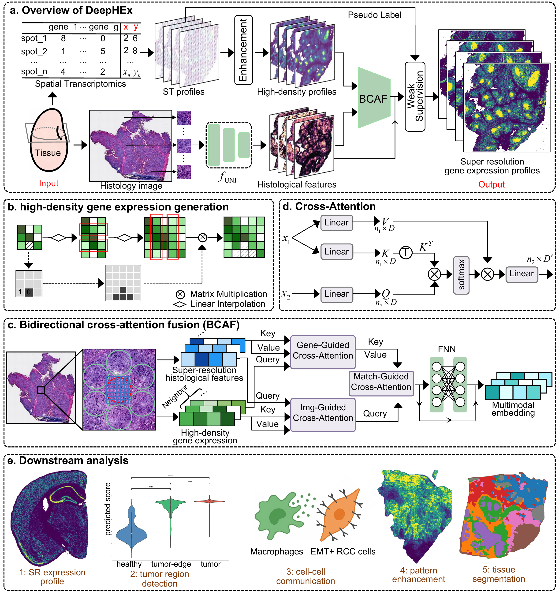

# Expression-guided multi-modal reconstruction of native tissue structures and biological landscapes with DeepHEx


## Overview

DeepHEx is a multi-modal deep learning framework designed to achieve high-resolution reconstruction of gene expression profiles by integrating histology images with spot-based spatial transcriptomics (ST) data within their native spatial context. By leveraging a self-supervised pathology foundation model and a bidirectional cross-attention mechanism, DeepHEx empowers high-fidelity biological insights, ranging from the identification of tissue architectures and tumor regions to the elucidation of cellular interactions and spatially variable gene patterns.




## Data
The datasets used in this paper can be downloaded from url：[https://zenodo.org/records/18153987](https://zenodo.org/records/18153987).

## Installation
All experiments were conducted on a single NVIDIA GeForce RTX 3090 GPU. The software has been tested and is compatible with both Windows and Linux operating systems.

1. Clone repository:

```bash
git clone https://github.com/minwenwen/DeepHEx.git
```

2. Create virtual environment:

```bash
conda create --name deephex python=3.11
```

3. Activate virtual environment:

```bash
conda activate deephex
```

4. Install dependencies:

```bash
pip install -r requirements.txt
```


## Repository Structure

```text
DeepHEx/
├── configs/      # Experiment configurations (YAML)
├── data/         # Data preprocessing and Dataset classes
├── model/        # feature extraction, expression enhancement, and core network
├── utils/        # Training engines and general utilities
├── interface.py  # Main script bridging data preprocessing and model training
└── pipeline.py   # Main script for model training
```


## Demo for running code

Once your environment is set up, follow these three steps to ignite the process:

### 1. Request UNI Access & Token

DeepHEx utilizes the **UNI** pathology foundation model for histological feature extraction.

* Request access to the UNI model on [https://huggingface.co/mahmoodlab/UNI](https://huggingface.co/mahmoodlab/UNI).
* Generate your Hugging Face Access Token.
* Fill in your token in the `login` field within the configuration file:

```yaml
# configs/config_demo.yaml
histology:
  login: "your_huggingface_token_here"
```

### 2. Prepare Your Data

We take the simulation experiment based on Visium HD data as an example. Please download the demo dataset from the [10x Genomics official website](https://www.10xgenomics.com/datasets/visium-hd-cytassist-gene-expression-libraries-of-mouse-brain-he):

1.  **Raw ST Data**: Navigate to the **Output and supplemental files** section and download **Binned outputs (all bin levels)**.
2.  **Raw Histology Image**: Navigate to the **Input files** section and download the **Microscope image**.

**Key Path Definitions:**

* **`directory`**: This is the absolute path to the sample root folder, used to store the raw data and all generated data.
* **`sample_size`**: This refers to the specific folder containing your raw ST data (e.g., Square_8um).
* **`raw_image_name`**: The filename of your histology image.

**Required File Structure:**

```text
/home/data/                 <-- Root folder (directory)
├── Square_8um/             <-- Raw ST data (sample_size)
└── sample_he.tif           <-- Raw histology image (raw_image_name)
```

**Update your YAML configuration:**
Edit `configs/config_demo.yaml` to match your local paths:

```yaml
global:
  directory: "your_root_folder"  # e.g., /home/data/

preprocessing:
  visium_hd:
    sample_size: "your_raw_visiumhd_data"        # e.g., square_008um
    raw_image_name: "your_raw_histology_image"  # e.g., Visium_HD_Mouse_Brain_tissue_image.tif
```

### 3. Execution

With the configuration ready, launch the integrated preprocessing and training workflow by running `interface.py`:

```bash
python interface.py --config configs/config_demo.yaml
```

---

> **Note**: For large-scale datasets or multiple states, you can adjust the `n_states` and `gpu_ids` in the YAML file to optimize performance.

In addition, we also provide preprocessed data in the Zenodo database: [https://zenodo.org/records/18153987](https://zenodo.org/records/18153987). After updating the directory field in the YAML configuration file, the pipeline can be executed by running `interface_Demo.py`:

```bash
python interface_Demo.py --config configs/config_demo.yaml
```

## Contact details

If you have any questions, please contact xueshuailin@gmail.com and minwenwen@yun.edu.cn.

